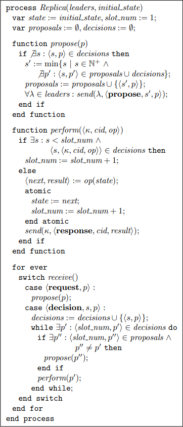

.. highlight:: c

.. _paxos-complex:

===============================================
【译】Paxos Made Moderately Complex
===============================================

:原文名:
    .. line-block::

        Paxos Made Moderately Complex

:翻译:
    .. line-block::

        `Jerry Lee oldratlee<at>gmail<dot>com <http://oldratlee.com>`_

| Robbert van Renesse
| Cornell University
| rvr@cs.cornell.edu

2011/03/25

.. _paxos-complex-abstract:

摘要
===============================================

对于任何一个要实现Paxos的人，Paxos决不是一个简单的协议，尽管它基于相对简单的不变式。本论文给出了 *完全Paxos* （The full Paxos）（或称为Multi-Paxos）的命令式的伪代码，不会回避讨论各种各样的实现细节。前一部分的描述先不考虑协议的优化让方便理解。后一部分讨论算法的活性（Liveness），并列出让协议更实用的各种优化。

.. _paxos-complex-intro:

1 介绍
===============================================

Paxos [13]_ 是允许Crash失效的异步环境中用状态机复制的协议。有必把这个句子中的术语都仔细过一下：

* *状态机* 由 一组状态、一组状态间的转换 和 一个当前状态 三者组成。响应一个发出的操作会 *转换* 到一个新的当前状态，并产生一个输出。从当前状态转换一个相同的状态是允许的，这用于建模一个只读操作。在一个 *确定状态机* （deterministic state machine）中，对于任一状态和任一操作，由这个操作触发的转换是唯一的。

* 在一个 *异步环境* 里，对计时上是没有要求的。时钟以任意的速度运行，网络通信消耗任意长的时间，状态机响应一个操作后执行转换消耗长的时间。这里用的术语“异步”不要和对象上的非阻塞操作（常常也被称为异步）混淆了。

* 如果状态机没有不再执行转换并且它的当前状态永远固定，则它已经经历了Crash失效（Failure）。没有其它的状态机失效，比如执行没有说明的转换，是不允许的。在一个“失效停止的环境”中 [21]_ ，Crash失效可以被可靠的检测到；但在一个异步环境中，做不到这一点。

* 状态机复制（State Machine Replication，SMR） [12]_ [22]_ 是一种掩盖失效的技术，特殊是Crash失效。一组确定状态机的Replica创建后，Replica提供的是一致的操作序列，所以最终它们会处于相同的状态并生成一致的输出序列。这里假设至少有一个Replica从没有Crash过。

确定状态机用来建模服务器的处理，比如文件服务器、DNS服务器等等。客户进程使用“stub routine”库通过网络给服务器发送 *命令* 。一个命令是一个三元组 ``<κ, cid, operation>``， κ [*]_:sup:`译注` 是发出命令的客户进程的标识符， *cid* 是客户本地唯一的命令标识符（比如是一个序列号）。命令标识符必须包含在服务器的响应中，这样客户端才能把服务器响应和发出去的命令匹配起来。在状态机复制中，stub routine会被替换掉，以制造远程服务器是高可用的假象。stub routine把命令发给所有的Replica，只有有一个响应就返回。

因为命令可能以不同的顺序到达Replica，所以多客户端带来的一个困难是Replica可能最终执行的是不同的转换，生成不同的输出，进而最终会有不同的当前状态。像Paxos这样的协议保证这种情况不会发生： 复制了的状态机逻辑行为和一个没有Crash [9]_ 的远程状态机一致。

进程是可能Crash的，我们假设进程间消息是可靠的（没有必要是FIFO的）：

* 从一个没有错误（non-faulty）的进程发送另一个没有错误进程的消息最终会被目标进程收到（至少一次）。

* 如果一个进程收到了一条消息，则这条消息是由某个进程发送的（这个进程可能是出错的进程）。也就是说，消息没有被篡改过，也不会凭空出现。

本论文给出了 *多维Paxos协议* （multi-decree Paxos protocol） 的 *操作说明* ，有时这个协议也被称为是 *multi-Paxos* 。单维Paxos是非常容易被理解，是 [15]_ [14]_ 等论文的主题。但是多维Paxos协议（或一些它的变种）正是被用到像Chubby [4]_ 和 ZooKeeper [10]_ 这样的工业强度系统中的协议。

.. _paxos-complex-how-why:

2 Paoxs如何工作和为什么能工作
===============================================

Replicas and Slots
------------------------------------

为了容忍 ``f`` 个Replica Crash，Paxos需要 ``f + 1`` 个Replica。当 ``κ`` 要执行命令 ``<κ, cid, op>`` 时，它需要广播消息 ``<*Request*, κ, cid, operation>>`` 给所有的Replica并等待有一个Replica的消息 ``<*Response*, cid, result>>`` 。

Replica可以被认为有一序列的Slot可以用于填入命令。每个Slot有一个Slot编号。Replica当收到消息 ``<request, p>`` 后，提交命令 p 到没有使用的最低编号的Slote中。有客户端并发操作的情况，不同的Replica可能在同一个Slot中提交不同的命令。为了避免这种不一致，Replica在真正更新状态前等待Slot的确定，计算出响应发回给客户端。

Replica没有必要在任何时间都是一致的。他们可能在不同的Slot中提交不同的命令。但是Replica在应用状态上执行的操作的顺序是一致的。图1 中是Replica的伪代码。任一个Replica ρ 维护了4个变量：

* ρ.state ，（外部不得见的）应用状态。所有的Replica的初始状态是相同的。

* ρ.slot_num ，Replica的当前slot编号（等价于状态的版本，初始值是1）。它包含的是在更新应用状态前下一个需要Learn决定的Slot。

* ρ.proposals ， <Slot编号, 命令>对的一个集合，Replica过去提交了的提案，初始值是 *空* 。

* ρ.decisions ，<Slot编号, 命令>对的一个集合，对应已经决定了的Slot，初始值也是 *空* 。

在给出Replica的操作说明之前，我们先陈述一下Replica的这些持有变量中的一些重要的不变式：

R1: 在相同的Slot中，已经决定了的命令没有2个是不同的： ∀s, ρ1, ρ2, p1, p2 : <s, p1> ∈ ρ1.decisions ∧ <s, p2> ∈ ρ2.decisions ⇒ p1 = p2

   图1：Replica的伪代码

.. _paxos-complex-references:

参考文献
===============================================

.. [1] P. Alvaro, T. Condie, N. Conway, J.M. Hellerstein, and R.C. Sears. I DoDeclare: Consensus in a logic language. In *Proceedings of the SOSP Workshop on Networking Meets Databases (NetDB)*, 2009.

.. [2] H. Attiya, A. Bar Noy, and D. Dolev. Sharing memory robustly in message passing systems. *Journal of the ACM*, 42(1):121-132, 1995.

.. [3] R. Boichat, P. Dutta, S. Frolund, and R. Guer-raoui. Deconstructing Paxos. *ACM SIGACT News*, 34(1), March 2003.

.. [4] M. Burrows. The Chubby Lock Service for loosely-coupled distributed systems. In *:sup:`7th` Sym-posium on Operating System Design and Implementation*, Seattle, WA, November 2006.

.. [5] T.D. Chandra, R. Griesemer, and J. Redstone. Paxos made live: an engineering perspective. In *Proc. of the 26:sup:`th` ACM Symp. on Principles of Distributed Computing*, pages 398-407, Portland, OR, May 2007. ACM.

.. [6] T.D. Chandra and S. Toueg. Unreliable failure detectors for asynchronous systems. InProc. of the 11th ACM Symp. on Principles of Dis-tributed Computing, pages 325{340, Montreal, Quebec, August 1991. ACM SIGOPS-SIGACT.

.. [7] M.J. Fischer, N.A. Lynch, and M.S. Patterson. Impossibility of distributed consensus with one faulty process. J. ACM, 32(2):374-382, April 1985.

.. [8] C. Gray and D. Cheriton. Leases: an efficient fault-tolerant mechanism for distributed file cache consistency. In *Proc. of the Twelfth ACM Symp. on Operating Systems Principles*, pages 202-210, Litchfield Park, AZ, November 1989.

.. [9] M. Herlihy and J. Wing. Linearizability: a correctness condition for concurrent objects. ACM Transactions on Programming Languages and Systems (TOPLAS), 12(3):463-492, 1990.

.. [10] F. Junqueira, P. Hunt, M. Konar, and B. Reed. The ZooKeeper Coordination Service (poster). In Symposium on Operating Systems Principles (SOSP), 2009.

.. [11] J. Kirsch and Y. Amir. Paxos for system builders. Technical Report CNDS-2008-2, Johns Hopkins University, 2008.

.. [12] L. Lamport. Time, clocks, and the order-ing of events in a distributed system. CACM, 21(7):558-565, July 1978.

.. [13] L. Lamport. The part-time parliament. Trans. on Computer Systems, 16(2):133-169, 1998.

.. [14] L. Lamport. Paxos made simple. ACM SIGACT News (Distributed Computing Col-umn), 32(4):51-58, 2001.

.. [15] B. Lampson. How to build a highly available system using consensus. In O. Babaoglu and K. Marzullo, editors,Distributed Algorithms, volume 115 ofLecture Notes on Computer Sci-ence, pages 1-17. Springer-Verlag, 1996.

.. [16] B.W. Lampson. The ABCD's of Paxos. In Proc. of the 20th ACM Symp. on Principles of Dis-tributed Computing, page 13, Newport, RI, 2001. ACM Press.

.. [17] H.C. Li, A. Clement, A. S. Aiyer, and L. Alvisi. The Paxos register. InProceedings of the 26th IEEE International Symposium on Reliable Dis-tributed Systems (SRDS 07), 2007.

.. [18] D. Mazieres. Paxos made practical. Technical Report on the web at scs.stanford.edu/~dm/home/papers/paxos.pdf, Stanford University, 2007.

.. [19] B.M. Oki and B.H. Liskov. Viewstamped repli-cation: A general primary-copy method to sup-port highly-available distributed systems. In Proc. of the 7th ACM Symp. on Principles of Distributed Computing, pages 8-17, Toronto, Ontario, August 1988. ACM SIGOPS-SIGACT.

.. [20] R. De Prisco, B. Lampson, and N. Lynch. Revis-iting the Paxos algorithm. Theoretical Computer Science, 243(1-2):35-91, July 2000.

.. [21] R.D. Schlichting and F.B. Schneider. Fail-stop processors: an approach to designing fault-tolerant computing systems. Trans. on Com-puter Systems, 1(3):222-238, August 1983.

.. [22] F.B. Schneider. Implementing fault-tolerant ser-vices using the state machine approach: A tuto-rial. ACM Computing Surveys, 22(4):299-319, December 1990.

.. [23] R.H. Thomas. A solution to the concurrency control problem for multiple copy databases. In Proc. of COMPCON 78 Spring, pages 88-93, Washington, D.C., February 1978. IEEE Com-puter Society.

.. _paxos-complex-notes:

注释
=====================

.. [*] 和 [13]_ 一样，使用希腊字母来标识进程。